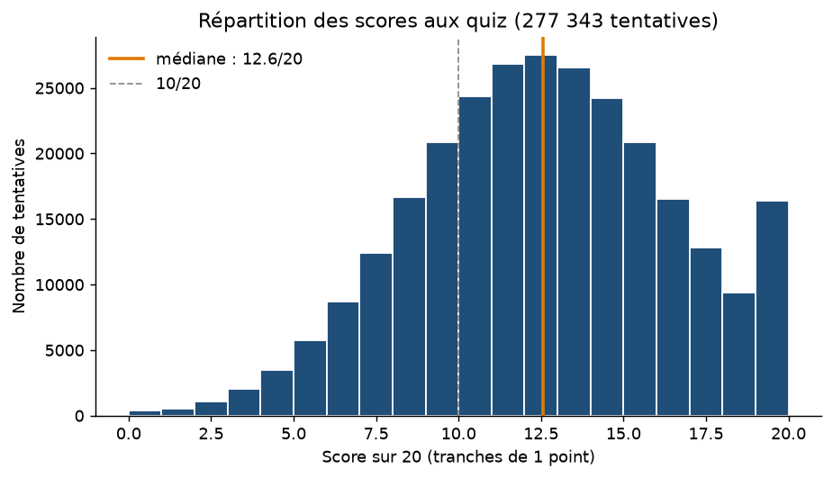
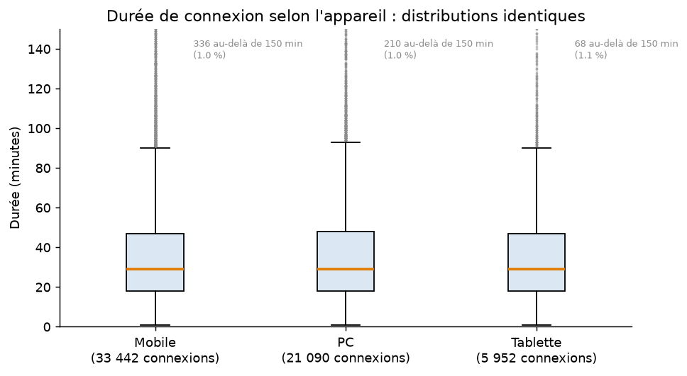
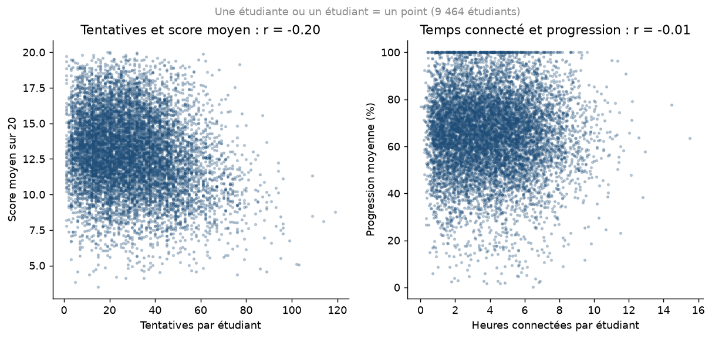
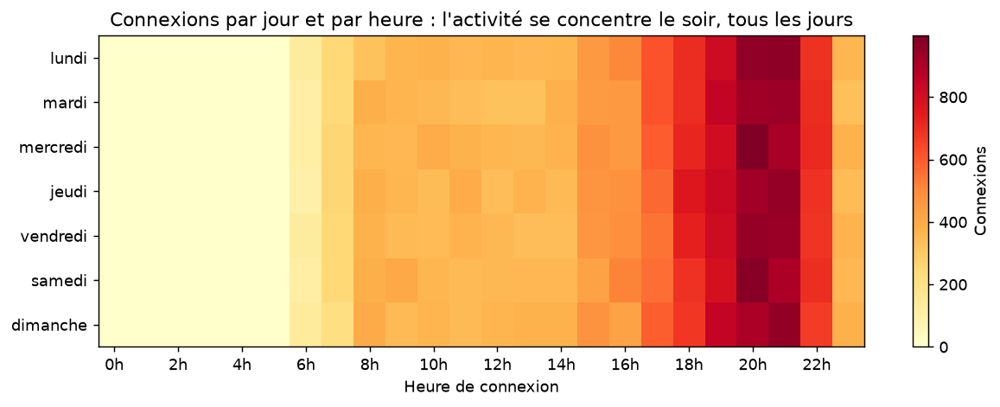
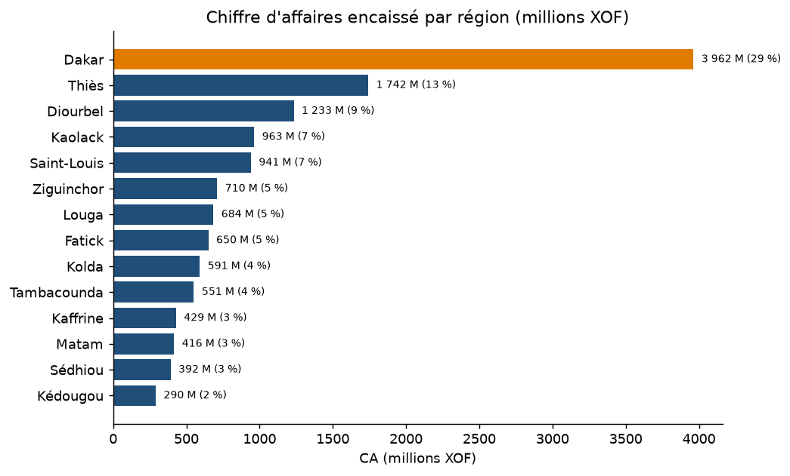

# Phase 12 — Analyse et visualisation des données

*EduSmart Decision Platform · Lot L8 · Étape 6 du module BI*

> **TP du PDF :** choisir les visualisations adaptées parmi l'histogramme, le boxplot, le scatterplot, la heatmap et le barplot. Pour chaque graphique : pourquoi ce choix ? pourquoi pas un autre ?
>
> Les 5 graphiques ci-dessous sont **produits depuis le DW** par `python -m scripts.visualisations` (dans `docs/figures/`). Leur transposition dans Power BI est décrite dans `powerbi/guide_powerbi.md` (§ 6).

---

## 1. Le principe : partir de la question, pas du graphique

Un graphique se choisit d'après **ce que la donnée doit révéler** :

| On veut montrer… | Graphique | Nature des données |
|---|---|---|
| une **distribution** (forme, centre, dispersion) | **Histogramme** | 1 variable quantitative, beaucoup d'observations |
| des **distributions à comparer** entre groupes | **Boxplot** | 1 variable quantitative × 1 variable qualitative |
| une **relation** entre deux mesures | **Scatterplot** | 2 variables quantitatives, une observation par point |
| une **intensité** selon deux axes | **Heatmap** | 2 variables qualitatives (ou discrétisées) × 1 mesure |
| une **comparaison** entre catégories | **Barplot** | 1 variable qualitative × 1 mesure agrégée |

Quatre règles s'appliquent à tous :
- un titre qui **énonce la conclusion** (« l'activité se concentre le soir »), et non le contenu (« connexions par heure ») ;
- des barres qui **partent de zéro** ;
- une couleur réservée à ce qui doit attirer l'œil ;
- **aucun** camembert à plus de trois parts, aucun effet 3D.

## 2. Les cinq graphiques d'EduSmart

### 2.1 Histogramme — Comment se répartissent les scores aux quiz ?

| | |
|---|---|
| **Données** | 277 343 tentatives notées (`fact_notes.score_sur_20`), tranches de 1 point |
| **Ce qu'il révèle** | Une distribution en **cloche**, de médiane **12,6/20** ; **25,9 %** des tentatives sont sous 10/20 ; un **pic à 20/20** (3,6 %, soit 10 111 tentatives) |
| **Pourquoi ce choix** | C'est le seul des cinq graphiques qui montre la **forme** d'une distribution. Le pic à 20/20 est un **effet plafond** : une note ne peut pas dépasser le maximum, donc les meilleurs s'y accumulent. En lecture métier, ces quiz ne distinguent plus les meilleurs étudiants. Prudence : une partie de l'effet peut venir de la simulation |
| **Pourquoi pas un autre** | Une **moyenne** (un seul nombre) cacherait le pic et la queue sous 10. Un **boxplot** résumerait la distribution en 5 nombres et ne montrerait pas le pic. Un **barplot** traiterait les notes comme des catégories sans ordre |
| **Dans Power BI** | Pas de visuel « histogramme » natif : graphique en colonnes sur la colonne `score_sur_20` **compartimentée** (taille 1) |

### 2.2 Boxplot — La durée de connexion dépend-elle de l'appareil ?

| | |
|---|---|
| **Données** | 60 484 connexions avec durée (`fact_connexions`), par appareil |
| **Ce qu'il révèle** | Des distributions **identiques** : médiane de 29 min et moitié centrale entre 18 et 48 min, sur mobile, PC et tablette. Environ 1 % des connexions dépasse 150 min, avec un maximum à 480 min |
| **Pourquoi ce choix** | Il compare **plusieurs distributions côte à côte** : médiane, quartiles, étendue et valeurs extrêmes. Conclure « l'appareil ne change rien » est un résultat à part entière : inutile de financer une application tablette **pour allonger les sessions** |
| **Pourquoi pas un autre** | Trois **histogrammes** superposés seraient illisibles ; un **barplot des moyennes** cacherait la dispersion et serait tiré vers le haut par les sessions de 8 h |
| **Lisibilité** | La longue traîne écrasait les boîtes : l'axe est limité à 150 min, et les valeurs au-delà sont **comptées à l'écran** plutôt que masquées en silence |
| **Dans Power BI** | Pas de visuel natif : visuel certifié « Box and Whisker chart » (AppSource), ou visuel Python reprenant `scripts/visualisations.py` |

### 2.3 Scatterplot — Deux mesures sont-elles liées ?

| | |
|---|---|
| **Données** | Un point par étudiant (9 464) ; à gauche, tentatives et score moyen ; à droite, heures connectées et progression moyenne |
| **Ce qu'il révèle** | À gauche, une relation **négative faible** (r = −0,20) : ceux qui ont besoin de plus de tentatives ont un score moyen plus bas. À droite, **aucune relation** (r = −0,01) : un nuage sans direction |
| **Pourquoi ce choix** | C'est **le** graphique de la relation entre deux variables quantitatives. Il montre la forme, la force, les exceptions, et aussi l'**absence** de relation |
| **Pourquoi pas un autre** | Un **coefficient seul** (r = −0,01) ne montre pas s'il y a une relation non linéaire ou des sous-groupes. Une **courbe** relierait des étudiants qui n'ont pas d'ordre entre eux |
| **Enseignement pour la Phase 14** | On ne pourra **pas** affirmer que « plus de temps connecté donne une meilleure progression » : les données ne le montrent pas. Le nuage sert à **tester** une relation avant de la raconter. Ces données étant simulées, le générateur a produit ces variables indépendamment |
| **Dans Power BI** | Nuage de points natif, `dim_etudiant[etudiant_id]` dans **Valeurs** (un point par étudiant) |

### 2.4 Heatmap — Quand les étudiants se connectent-ils ?

| | |
|---|---|
| **Données** | 62 142 connexions (`fact_connexions`), 7 jours × 24 heures = 168 cases |
| **Ce qu'il révèle** | Un pic entre **20 h et 22 h, tous les jours**. Environ la moitié des connexions a lieu entre 18 h et minuit, **aucune** entre minuit et 6 h, et il n'y a **pas d'effet du jour de la semaine** (le week-end ressemble à la semaine) |
| **Pourquoi ce choix** | Deux axes discrets (jour, heure) et une intensité : la couleur fait lire 168 valeurs d'un coup d'œil. Décision directe : programmer les classes virtuelles et les notifications **le soir**, maintenance **la nuit** |
| **Pourquoi pas un autre** | Un **barplot** par heure perdrait le jour (ou il faudrait 7 barplots) ; un **tableau** de 168 nombres ne se lit pas ; 7 **courbes** superposées se chevaucheraient |
| **Dans Power BI** | Matrice (jour en lignes, heure en colonnes) avec **mise en forme conditionnelle** de l'arrière-plan (échelle de couleurs) |

### 2.5 Barplot — Quelles régions portent le chiffre d'affaires ?

| | |
|---|---|
| **Données** | CA encaissé (`fact_paiements.montant_ca`) par région, en millions de XOF |
| **Ce qu'il révèle** | **Dakar : 29 %** du CA, plus du double de Thiès (13 %) ; les régions suivent en pente douce. La couleur signale la région principale |
| **Pourquoi ce choix** | Comparer une mesure entre **catégories** : la longueur des barres est ce que l'œil compare le mieux. Barres **horizontales**, pour lire les noms de région, et **triées** |
| **Pourquoi pas un autre** | Un **camembert** à 14 parts est illisible : on ne compare pas des angles. Une **carte géographique** est séduisante, mais on y compare mal des intensités de couleur ; elle peut compléter, pas remplacer |
| **Dans Power BI** | Graphique à barres groupées, avec une hiérarchie Géographie (région › ville) pour le **drill down** de la Phase 10 |

## 3. Au-delà des cinq : les visuels du tableau de bord

| Visuel | Usage | Pourquoi |
|---|---|---|
| **Carte (KPI)** | Les 8 KPI | Un nombre, avec une couleur par rapport à la cible |
| **Courbe** | CA par mois (saisonnalité) | L'évolution dans le **temps** : les points sont ordonnés, le trait a un sens |
| **Histogramme groupé** | CA et montant dû par année | Deux mesures comparées par catégorie |
| **Carte texte** | Satisfaction : « Non mesurée » | Rendre visible un manque de données plutôt que le cacher |

## Références

- PDF « BI Recherche P8 », Phase 12.
- E. Tufte, *The Visual Display of Quantitative Information* (1983) : rapport données/encre.
- C. Nussbaumer Knaflic, *Storytelling with Data* (2015) : choisir le visuel d'après le message.
- J. Tukey, *Exploratory Data Analysis* (1977) : la boîte à moustaches.
